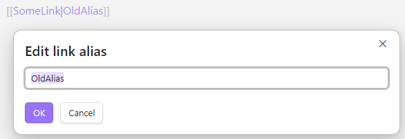

# Edit Link Alias

[](https://www.buymeacoffee.com/mnaoumov)
[](https://github.com/mnaoumov/obsidian-edit-link-alias/releases)
[](https://github.com/mnaoumov/obsidian-edit-link-alias/releases)
[](https://github.com/mnaoumov/obsidian-edit-link-alias)

This is a plugin for [Obsidian](https://obsidian.md/) that adds edit link alias command.



## Demo vault

A demo vault with usage examples ships with every release. You can access it via any of the following:

1. Running the **Edit Link Alias: Open demo vault** command.
2. Downloading `edit-link-alias.demo-vault.zip` from the [Releases](https://github.com/mnaoumov/obsidian-edit-link-alias/releases).
3. Browsing its source in [`demo-vault/`](./demo-vault/README.md) in this repository.

## Installation

The plugin is available in [the official Community Plugins repository](https://community.obsidian.md/plugins/edit-link-alias).

### Beta versions

To install the latest beta release of this plugin (regardless if it is available in [the official Community Plugins repository](https://community.obsidian.md) or not), follow these steps:

1. Ensure you have the [BRAT plugin](https://community.obsidian.md/plugins/obsidian42-brat) installed and enabled.
2. Click [Install via BRAT](https://intradeus.github.io/http-protocol-redirector?r=obsidian://brat?plugin=https://github.com/mnaoumov/obsidian-edit-link-alias).
3. An Obsidian pop-up window should appear. In the window, click the `Add plugin` button once and wait a few seconds for the plugin to install.

## Debugging

By default, debug messages for this plugin are hidden.

To show them, run the following command in the `DevTools Console`:

```js
window.DEBUG.enable('edit-link-alias');
```

For more details, refer to the [documentation](https://mnaoumov.dev/obsidian-dev-utils/guides/debugging/).

## Support

<!-- markdownlint-disable MD033 -->

<a href="https://www.buymeacoffee.com/mnaoumov" target="_blank"></a>

<!-- markdownlint-enable MD033 -->

## My other Obsidian resources

[See my other Obsidian resources](https://github.com/mnaoumov/obsidian-resources).

## License

© [Michael Naumov](https://github.com/mnaoumov/)
